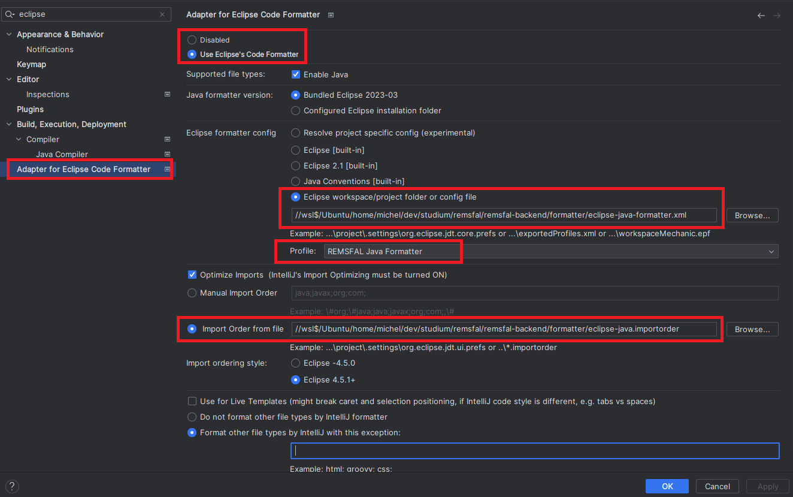

# Formatting

This directory contains the Eclipse formatting configuration files used to enforce the same code style on all contributors.

## Eclipse
Import the formatting configs by Settings->Java->Code Style->"Import"

## IntelliJ
The following plugin extends the import capabilities of the Eclipse Formatter in IntelliJ.

In case you don't want to use it, you can still import the formatter xml in your code style settings. But note that not all configs are supported.
https://plugins.jetbrains.com/plugin/6546-adapter-for-eclipse-code-formatter

1. Install the plugin
2. Open the plugin configuration in settings
3. Add the formatter config files (see the screenshot below)

